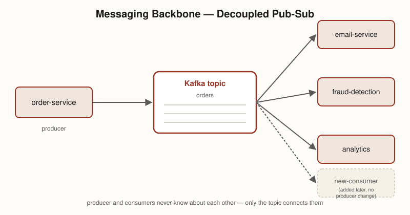
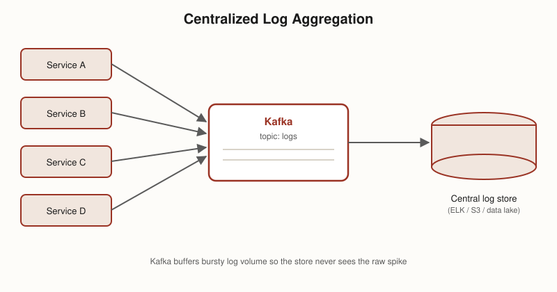
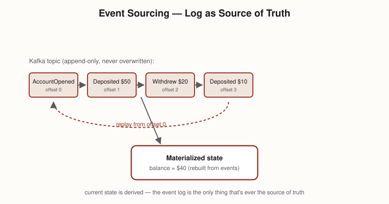
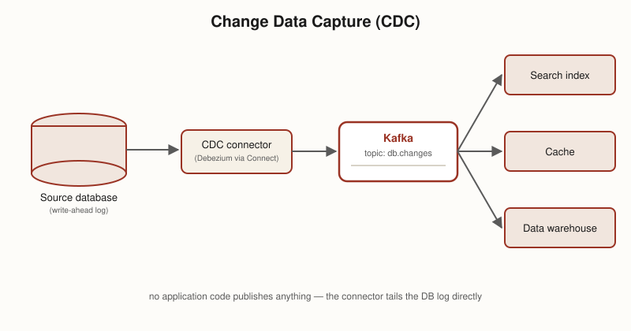
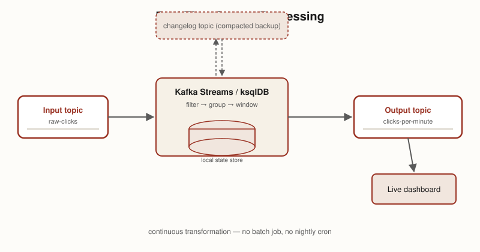

Kafka is a distributed, durable, append-only log — not a traditional "consume and delete" message queue. A topic is split into partitions for parallelism, each partition is replicated across brokers (one leader, N followers) for fault tolerance, and consumer groups parallelize reading (each partition read by exactly one consumer within a group). Delivery is at-least-once by default, so consumers must be idempotent — exactly-once is available via transactions. Around this core, an ecosystem (Connect, Streams/ksqlDB, Schema Registry) turns Kafka from "just a log" into a full data-integration and stream-processing platform.

This is written as a step-by-step glossary — each numbered section builds on the terms introduced before it.

## 1. What Kafka actually is

Originally built at LinkedIn (~2010) to handle their firehose of activity/event data, then open-sourced as an Apache project. The core idea: it's not really a message queue in the RabbitMQ/SQS sense (publish → consume → delete) — it's a **distributed, durable, append-only log** that you subscribe to. Nothing gets deleted when a consumer reads it; a consumer just tracks an **offset** (a cursor position) and moves it forward.

That one design choice is why Kafka gets used for three overlapping purposes:
1. **Pub-sub messaging** — decoupling services (producer publishes, N independent consumers read, none know about each other).
2. **A durable system of record** — since nothing is deleted on read, a topic can be the actual source of truth, replayable from the beginning at any time.
3. **A substrate for stream processing** — tools like Kafka Streams / ksqlDB process data directly as it flows through.

It's also fast largely *because* it's simple: appending to the end of a file and reading sequentially forward is about the cheapest I/O pattern that exists (sequential disk/page-cache access), versus a traditional queue's per-message delete/ack bookkeeping.

## 2. Cluster, brokers, and the controller

A Kafka **cluster** is a set of servers called **brokers**. No single broker holds all the data — partitions (see step 4) are spread across brokers so both storage and throughput scale horizontally.

Someone still has to track cluster-wide metadata: which topics/partitions exist, which broker is the leader for each partition, and which brokers are currently alive. Since **KRaft** (Kafka Raft — Kafka 3.x+, and the only mode from Kafka 4.0 onward), a subset of brokers act as **controllers**, forming a Raft quorum that stores this metadata in its own internal log and elects a single active controller. Older deployments used an external **ZooKeeper** ensemble for the same job; KRaft folds that responsibility into Kafka itself, removing the extra system to run and keep in sync.


flowchart TB
  subgraph QUORUM["KRaft Controller Quorum"]
    C1["Controller (active)"]
    C2["Controller (standby)"]
    C3["Controller (standby)"]
  end
  subgraph CLUSTER["Kafka Cluster"]
    B1["Broker 1"]
    B2["Broker 2"]
    B3["Broker 3"]
  end
  QUORUM -- "metadata log:\ntopics, partitions,\nleaders, live brokers" --> CLUSTER
  C1 -.raft consensus.-> C2
  C1 -.raft consensus.-> C3


## 3. Topics

A **topic** is a named stream of records — a category things get published to and read from (e.g. `orders`, `payment-events`).
- **Multi-producer, multi-consumer** — any number of producers can write, any number of independent consumers/consumer groups can read, with no knowledge of each other. This is the actual decoupling mechanism.
- **A record is just bytes** — key, value, optional headers, timestamp. Kafka enforces no schema; if you want structure (Avro/Protobuf/JSON with a defined shape), that's a separate layer (a Schema Registry — step 11), not something Kafka itself understands.
- **A topic is a logical name, not the physical unit of storage or parallelism.** That's partitions.

## 4. Partitions & offsets

A topic is split into **partitions** — ordered, append-only logs, and the actual unit Kafka parallelizes storage and throughput across (not the topic itself). Kafka guarantees ordering **within a partition only** — never across partitions of the same topic.

Every record written to a partition gets a sequential, immutable **offset** — its position in that partition's log. A consumer's "position" is just the offset it has processed up to.

How a record picks its partition:
- **Keyed record** — the default partitioner hashes the key (`hash(key) % numPartitions`), so the same key always lands on the same partition — this is what preserves per-key ordering (e.g. all events for `order-123` stay in order).
- **No key** — Kafka spreads records across partitions (sticky/round-robin) purely for load balancing, with no ordering guarantee between them.


flowchart LR
  R1["record key=order-123"] --> H["hash(key) % partitions"]
  R2["record key=order-456"] --> H
  R3["record key=order-123"] --> H
  H --> P0["Partition 0\noffsets: 0,1,2,3..."]
  H --> P1["Partition 1\noffsets: 0,1,2..."]
  H -.order-123 always here.-> P0


## 5. Producers & delivery guarantees

**Producers** write records to topics. Two settings control how safely:

**`acks`** — how many replicas must confirm a write before the producer considers it successful:
- `acks=0` — fire and forget, don't even wait for the leader. Fastest, weakest.
- `acks=1` — wait for the leader to write it. If the leader dies *before* followers replicate, that message is gone even though the producer got a success response.
- `acks=all` (`-1`) — wait for every replica in the ISR (step 6). Strongest durability, higher latency.

**Idempotent producer** (`enable.idempotence=true`, default in modern clients) — each producer gets a **producer ID** and tags every record with a **sequence number**. If a network hiccup makes the producer retry a send, the broker recognizes the duplicate sequence number and drops it instead of writing the record twice. This is what makes retries safe without the application having to dedupe manually.


sequenceDiagram
  participant P as Producer
  participant L as Leader replica
  participant F1 as Follower 1
  participant F2 as Follower 2
  P->>L: send record (acks=all)
  L->>F1: replicate
  L->>F2: replicate
  F1-->>L: ack
  F2-->>L: ack
  L-->>P: ack (all ISR confirmed)


**Common question: can messages arrive out of order?** A producer isn't bound to a single partition — it decides per-record where to route via an explicit partition number, key hashing (default), or round-robin when there's no key (step 4). This has two consequences worth being explicit about:
- **Across partitions, there is no ordering guarantee at all.** If message 1 goes to partition 1 and message 2 goes to partition 2, they're independent logs with independent leaders — it's entirely possible for message 2 to be written and read before message 1. This isn't a bug or a race condition to fix; Kafka simply never promised ordering across partitions.
- **Within one partition**, ordering is only automatic if you use the same key for related records (so they always hash to the same partition) *and* `enable.idempotence=true`. Without idempotence, a producer with multiple requests in flight (`max.in.flight.requests.per.connection > 1`) can have a retried record land **after** a later one that succeeded on the first try — reordering the same partition's log. Idempotence prevents this because the broker tracks each producer's sequence numbers and can detect/reject out-of-sequence writes.

So: **same key → same partition → in-order, as long as idempotence is on.** Different keys or no key → no ordering promise between those records, ever.

## 6. Replication, leader election, and ISR

Each partition has a **replication factor** (commonly 3): one broker holds the **leader** replica, the others hold **follower** replicas.
- Followers don't get pushed data — they **pull** from the leader, using the same fetch mechanism a normal consumer uses. No separate replication protocol.
- The set of replicas caught up enough to be trustworthy is the **ISR — in-sync replicas**. A follower that falls too far behind (configurable lag threshold) gets dropped from the ISR until it catches up.
- If the leader dies, a new leader is elected **only from the ISR** — never from a lagging replica, since that could silently lose committed data.

**Gotcha:** `acks=all` only guarantees what "all" currently means. If the ISR has shrunk to just the leader (followers all lagged out), "all" means "one." **`min.insync.replicas`** guards against this — it sets a floor (e.g. 2) below which the leader refuses writes rather than silently downgrading the durability guarantee.


sequenceDiagram
  participant Ctrl as Controller
  participant L as Leader (Broker 1)
  participant F as Follower (Broker 2, in ISR)
  Note over L: Broker 1 crashes
  Ctrl->>Ctrl: detect missed heartbeat
  Ctrl->>F: elect as new leader (was in ISR)
  Ctrl-->>Ctrl: update metadata (new leader = Broker 2)
  Note over F: Broker 2 now serves\nproduce/consume for this partition


## 7. Consumers & consumer groups

**Consumers** read records; they're organized into **consumer groups**. Within a given group, each partition is read by exactly one consumer — that's how Kafka parallelizes consumption (add more consumers, up to one per partition, for more parallelism).

Each group tracks its own progress independently, via **committed offsets** stored in an internal topic (`__consumer_offsets`). This means multiple, unrelated consumer groups can read the same topic at completely different paces without affecting each other — e.g. a real-time alerting group and a nightly batch-analytics group reading the same `orders` topic.

Default delivery guarantee is **at-least-once** (so consumers must be idempotent — the same event can arrive twice); stronger guarantees are covered in step 10.

## 8. Rebalancing

**Rebalancing** happens whenever consumer group membership changes — a consumer joins, leaves, or crashes (missed heartbeat) — and partitions need to be redistributed among the remaining/new consumers.


sequenceDiagram
  participant C1 as Consumer 1
  participant C2 as Consumer 2 (new)
  participant Coord as Group Coordinator (broker)
  C2->>Coord: join group
  Coord->>C1: revoke partitions
  Coord->>Coord: run partition assignor
  Coord->>C1: assign new partition subset
  Coord->>C2: assign new partition subset
  Note over C1,C2: consumption resumes


Older ("eager") rebalancing revokes *all* partitions from *every* consumer before reassigning — a brief stop-the-world pause for the whole group. **Incremental cooperative rebalancing** only moves the partitions that actually need to move, letting unaffected consumers keep processing throughout.

## 9. Retention & log compaction

Retention is configured **per topic**, and controls when old data disappears:
- **Time-based** — e.g. keep records for 7 days, then delete.
- **Size-based** — cap the partition's total size.
- **Compaction** — instead of deleting by age, keep only the **latest value per key**, forever. Used when a topic represents "current state" rather than "history of events" (e.g. a changelog of user profiles, or Kafka Streams' internal changelog topics from step 13). Writing a record with a `null` value for a key (a **tombstone**) marks that key for deletion once compaction runs.


flowchart LR
  subgraph BEFORE["Before compaction"]
    direction TB
    A1["K1=v1"] --> A2["K2=v2"] --> A3["K1=v3"] --> A4["K3=v4"] --> A5["K1=v5"]
  end
  subgraph AFTER["After compaction"]
    direction TB
    B2["K2=v2"] --> B4["K3=v4"] --> B5["K1=v5"]
  end
  BEFORE -. "compaction: keep\nonly latest per key" .-> AFTER


## 10. Delivery semantics & exactly-once

Three levels, in order of how much work they take to get:
- **At-most-once** — no retries; a message can be lost, never duplicated.
- **At-least-once** — Kafka's default; retries can create duplicates, so consumers must be idempotent.
- **Exactly-once** — built from two pieces: the **idempotent producer** (step 5, dedupes retries on write) plus **transactions**. A transactional producer (given a `transactional.id`) can write to multiple partitions/topics and mark them committed atomically; a consumer with `isolation.level=read_committed` only ever sees records from committed transactions, skipping aborted ones entirely. This is exactly how Kafka Streams gets exactly-once for a *consume → transform → produce* pipeline.


sequenceDiagram
  participant Src as Input topic
  participant App as Stream processor (transactional)
  participant Dst as Output topic
  App->>Src: consume batch (isolation.level=read_committed)
  App->>App: transform
  App->>App: beginTransaction()
  App->>Dst: produce results
  App->>Src: commit consumer offsets (as part of txn)
  App->>App: commitTransaction()
  Note over Dst: downstream read_committed\nconsumers only see this\nafter commit succeeds


## 11. Schema Registry

Kafka itself doesn't understand or enforce record structure — a value is just bytes. A **Schema Registry** (Confluent's, or open-source alternatives) adds that structure back as a separate service: it stores schema definitions (commonly Avro, Protobuf, or JSON Schema), and producer/consumer serializers talk to it.

- A producer's serializer registers (or looks up) the schema, then writes only a small **schema ID** alongside the encoded bytes — not the whole schema on every record.
- A consumer's deserializer fetches the schema by that ID to decode the bytes correctly.
- **Compatibility modes** (backward / forward / full) let the registry reject a schema change that would break existing producers or consumers, giving you safe schema evolution over time.


flowchart LR
  P["Producer"] -->|"register/lookup schema"| SR["Schema Registry"]
  P -->|"record: [schema ID][avro bytes]"| T["Kafka topic"]
  T --> C["Consumer"]
  C -->|"fetch schema by ID"| SR


## 12. Kafka Connect

**Kafka Connect** is a framework for moving data in and out of Kafka without writing custom producer/consumer code.
- **Source connectors** pull data from an external system (a database, files, an API) into a Kafka topic.
- **Sink connectors** push data from a Kafka topic into an external system (Elasticsearch, S3, a data warehouse).
- Connectors run as **distributed workers**, and each connector splits its work into parallel **tasks**.


flowchart LR
  DB[("Source DB")] --> SRC["Source Connector"]
  SRC --> T["Kafka topic"]
  T --> SINK["Sink Connector"]
  SINK --> DW[("Data Warehouse")]


## 13. Kafka Streams / ksqlDB

**Kafka Streams** is a client library (not a separate cluster) for processing data directly as it flows through Kafka — reading from input topics, transforming, and writing to output topics. **ksqlDB** puts a SQL layer on top of the same engine, so you can express stream processing as SQL-like queries instead of Java/Scala code.

Stateful operations (aggregations, joins, windowed counts) keep their working state in a local **state store**, which is continuously backed up to an internal **changelog topic** (a compacted topic — step 9) so state survives a crash or gets rebuilt on another instance.


flowchart LR
  IN["Input topic:\nraw-clicks"] --> PROC["Stream processor\n(filter, group, window)"]
  PROC <-->|"backs up to"| CL["Changelog topic\n(compacted)"]
  PROC --> STORE[("Local state store")]
  PROC --> OUT["Output topic:\nclicks-per-minute"]


## 14. Security basics

Three independent layers, commonly used together:
- **Encryption in transit** — TLS between clients and brokers.
- **Authentication** — proving *who* a client is: SASL mechanisms (PLAIN, SCRAM) or mutual TLS (mTLS, using client certificates).
- **Authorization** — **ACLs** decide what an authenticated principal is allowed to do (produce to topic X, consume from topic Y, create topics, etc.).


flowchart LR
  CL["Client"] -->|"1. TLS handshake"| B["Broker"]
  CL -->|"2. SASL/mTLS auth"| B
  B -->|"3. check ACL for principal + topic + operation"| DEC{"Allowed?"}
  DEC -->|yes| OK["Request served"]
  DEC -->|no| DENY["AuthorizationException"]


## 15. Quotas & monitoring

**Quotas** cap the byte-rate (or request rate) a given client/user can push or pull, so one noisy producer or consumer can't starve everyone else sharing the cluster.

The single most important thing to watch operationally is **consumer lag** — the gap between a partition's latest offset and a consumer group's committed offset. Growing lag means a consumer group is falling behind the rate records are being produced. It's typically tracked via Kafka's JMX metrics, exported to Prometheus, and graphed in Grafana (or tools like Burrow built specifically for lag tracking).

## 16. Architecture at a glance

A worked example tying the terms above together: topic `orders`, 3 partitions, replication factor 3, one consumer group (`analytics-group`) with 2 consumers.


flowchart LR
  subgraph PR["Producers"]
    P1["order-service"]
    P2["payment-service"]
  end

  CTRL["Controller\n(KRaft quorum)\ntracks metadata,\nelects leaders"]

  subgraph CLUSTER["Kafka Cluster — topic: orders"]
    direction LR
    subgraph B1["Broker 1"]
      B1P0["P0 — LEADER"]
      B1P1["P1 — replica"]
      B1P2["P2 — replica"]
    end
    subgraph B2["Broker 2"]
      B2P1["P1 — LEADER"]
      B2P0["P0 — replica"]
      B2P2["P2 — replica"]
    end
    subgraph B3["Broker 3"]
      B3P2["P2 — LEADER"]
      B3P0["P0 — replica"]
      B3P1["P1 — replica"]
    end
  end

  subgraph CG["Consumer Group: analytics-group"]
    C1["consumer-1\nreads P0"]
    C2["consumer-2\nreads P1, P2"]
  end

  P1 --> CLUSTER
  P2 --> CLUSTER
  CTRL -.manages.-> B1
  CTRL -.manages.-> B2
  CTRL -.manages.-> B3
  B1P0 --> C1
  B2P1 --> C2
  B3P2 --> C2


Note how leaders are spread round-robin across brokers (Broker 1 leads P0, Broker 2 leads P1, Broker 3 leads P2) rather than piling onto one broker — that's real Kafka behavior, not a simplification, and it's what keeps write load balanced across the cluster.

## Use cases

### Messaging backbone (decoupled pub-sub)

Kafka replaces point-to-point integrations between services with one shared log. `order-service` publishes to a topic without knowing who reads it; `email-service`, `fraud-detection`, and `analytics` each read independently, at their own pace, and a new consumer can be added later without touching the producer at all.

### Centralized log aggregation

Many services each emit logs; instead of each one shipping directly to a log store, they all publish to Kafka, and one pipeline reads from Kafka into the actual store (Elasticsearch, S3, a data lake). Kafka absorbs bursts and buffers the store from load spikes it can't otherwise handle in real time.

### Event sourcing

Instead of storing only current state, the topic itself *is* the source of truth — every state change is appended as an event, forever (or compacted to latest-per-key, step 9). Application state is a **materialized view** that's rebuilt by replaying the log from the beginning, which also gives you a full audit trail for free.

### Change Data Capture (CDC)

A CDC connector (e.g. Debezium, run via Kafka Connect — step 12) tails a database's write-ahead log and publishes every row-level change to a Kafka topic in near real time — without the application code ever having to publish anything itself. Downstream, a search index, a cache, and a data warehouse can each independently stay in sync with the source database.

### Real-time stream processing

Kafka Streams or ksqlDB (step 13) continuously transform, filter, join, and aggregate data as it arrives — e.g. turning a raw `clicks` topic into a `clicks-per-minute` topic — and write the result back to Kafka or out to a live dashboard, with no batch job or nightly cron involved.

